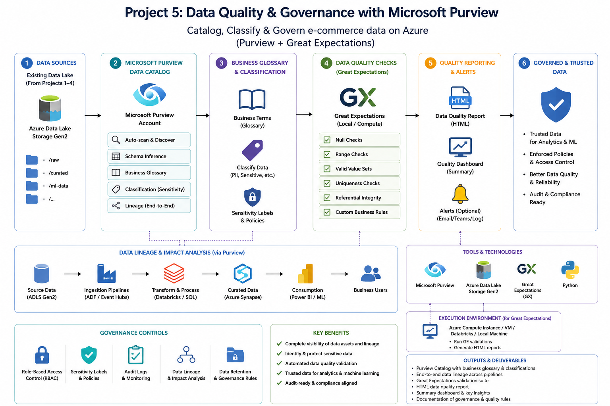
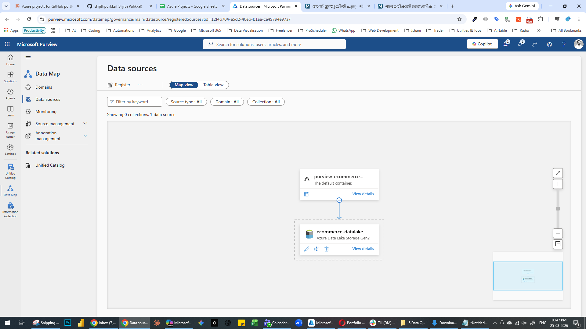
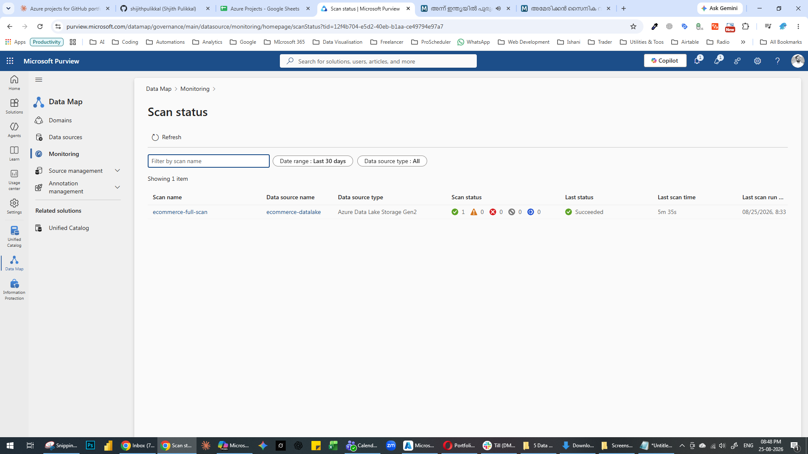
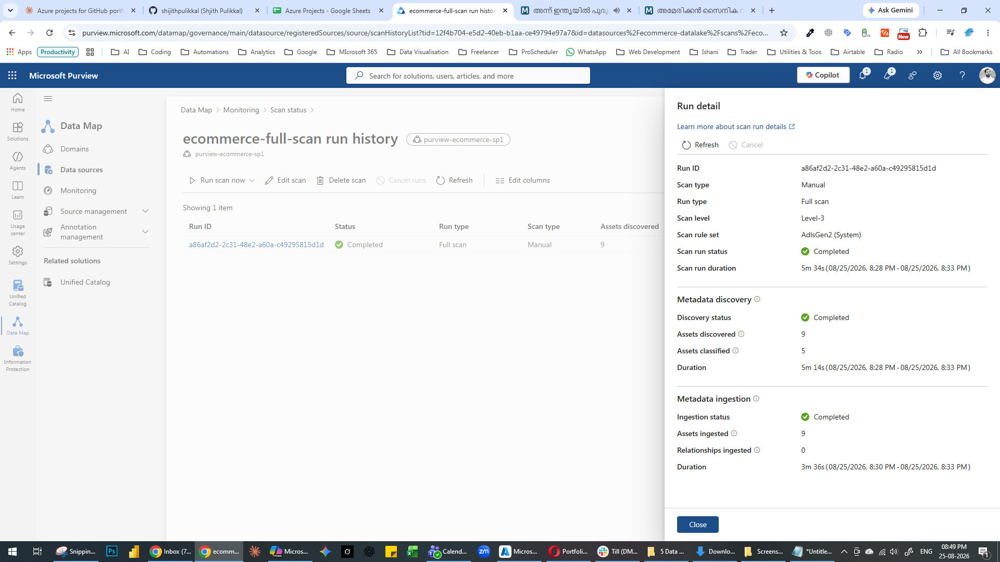
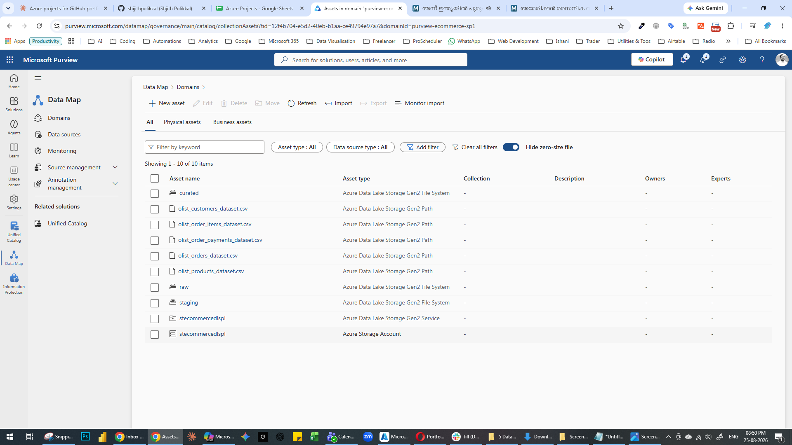
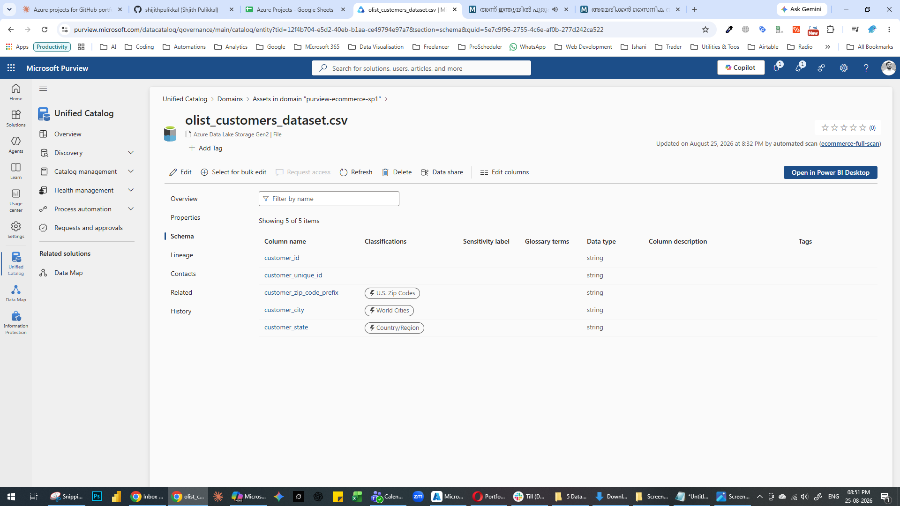
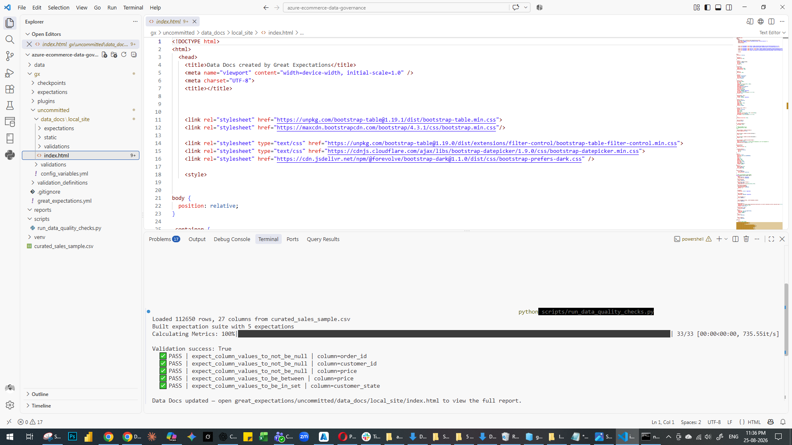
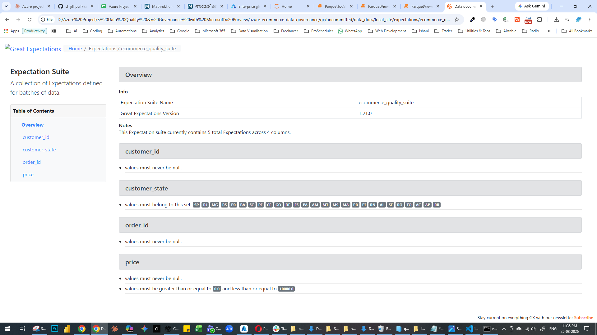

# E-Commerce Data Quality & Governance on Azure

A governance layer built on top of the e-commerce data lake — cataloging what data exists and where using Microsoft Purview, classifying sensitive fields, attaching business context, and validating data quality with automated Great Expectations checks. This is the fifth and final project in a series exploring different facets of the Azure data platform: this one focuses on *trusting* the data rather than moving or analyzing it.



---

## 📌 Problem Statement

Pipelines that move and transform data are only useful if the data itself can be trusted, and if anyone in an organization can actually find and understand what exists in the lake. This project adds two governance capabilities on top of the existing e-commerce data lake: **Microsoft Purview** for cataloging, classification, and business glossary context, and **Great Expectations** for automated, repeatable data quality validation — the kind of checks that should run before data is trusted downstream.

---

## 🏗️ Approach

```
ADLS Gen2 (raw / staging / curated)
        │
        ├──→ Microsoft Purview: register source → scan → auto-classify → glossary terms
        │
        └──→ Great Expectations: define expectations → validate curated data → Data Docs report
```

---

## 🛠️ Tech Stack

| Component | Purpose |
|---|---|
| **Microsoft Purview** | Data catalog, automated scanning, sensitive data classification, business glossary |
| **Great Expectations 1.21.0** | Defines and runs automated data quality checks against curated data, generating a browsable HTML report |
| **Python (pandas)** | Loads curated data for validation |
| **Azure Data Lake Storage Gen2** | The underlying data source being cataloged and validated (shared with [Project 1](../azure-ecommerce-analytics-pipeline)) |

---






## 📊 Findings

### Microsoft Purview — Catalog & Classification

- Registered the `ecommerce-datalake` source under the `purview-ecommerce-sp1` domain and ran `ecommerce-full-scan`, an automated scan covering the raw/staging/curated containers.
- Purview automatically detected the full schema for every file with no manual mapping — e.g. `olist_customers_dataset.csv` was parsed into its 5 columns (`customer_id`, `customer_unique_id`, `customer_zip_code_prefix`, `customer_city`, `customer_state`) with correct data types, entirely from the automated scan.
- **Automated classification results on the customer dataset:**

  | Column | Classification | Data Type |
  |---|---|---|
  | `customer_id` | *(none)* | string |
  | `customer_unique_id` | *(none)* | string |
  | `customer_zip_code_prefix` | **U.S. Zip Codes** | string |
  | `customer_city` | **World Cities** | string |
  | `customer_state` | **Country/Region** | string |

  Purview automatically flagged all three location-related columns as classifiable, without any manual tagging — a concrete example of automated sensitive/location-data detection working out of the box.

- **Honest note on classification accuracy:** Purview labeled `customer_zip_code_prefix` as **"U.S. Zip Codes"**, but this dataset is Brazilian (Olist), so the classifier's label is geographically incorrect even though it correctly identified the column as containing postal-code-like data. This is a useful, realistic finding for a governance project — it shows *why* human review of automated classification matters rather than trusting it blindly, which I've called out explicitly in Next Steps below.
- Glossary terms were not yet attached to these columns at time of writing — see Next Steps.

### Great Expectations — Data Quality Validation





**Result: ✅ All 5 expectations passed** against 112,650 rows of curated sales data.

| Expectation | Column | Result |
|---|---|---|
| Not null | `order_id` | ✅ PASS |
| Not null | `customer_id` | ✅ PASS |
| Not null | `price` | ✅ PASS |
| Value between 0–10,000 | `price` | ✅ PASS |
| Value in valid Brazilian state set | `customer_state` | ✅ PASS |

**What this means:** the curated layer has no missing values in its key business fields, prices fall within a sane range with no negative or absurd outliers, and every customer state code maps to a real, known value — i.e., no free-text typos or corrupted geography data made it through the pipeline.

**Honest caveat:** this validation run found no failures, which is a genuinely good outcome for a small, already-cleaned public dataset — but it also means this suite hasn't yet been tested against messier data. See "Next Steps" below for how I'd stress-test it further.

---

## 🔁 How to Reproduce

1. **Provision Microsoft Purview** and grant it `Storage Blob Data Reader` on your storage account (see project write-up for CLI commands).
2. **Register and scan** your ADLS Gen2 source in Purview Studio, covering `raw`, `staging`, and `curated` containers.
3. **Review classification results** and add glossary terms for any business-meaningful fields.
4. **Install Great Expectations:**
   ```bash
   pip install great_expectations==1.21.0 pandas
   ```
5. **Run the quality checks:**
   ```bash
   python scripts/run_data_quality_checks.py
   ```
6. **View the report:**
   ```
   gx/uncommitted/data_docs/local_site/index.html
   ```

> Note: Great Expectations 1.x uses a file-backed context (`gx.get_context(mode="file", project_root_dir=".")`) so Data Docs persist to disk under a `gx/` folder — this differs from the older 0.x API, which used a `great_expectations/` folder by default.

---

## 📂 Repo Structure

```
azure-ecommerce-data-governance/
├── README.md
├── architecture-diagram.png
├── scripts/
│   └── run_data_quality_checks.py
├── gx/
│   └── ecommerce_quality_suite.html
└── reports/
    ├── screenshot 1.png
    ├── screenshot 2.png
    ├── screenshot 3.png
    ├── screenshot 4.png
    ├── screenshot 5.png
    ├── screenshot 6.png
    └── screenshot 7.png
    
```

---

## 💡 Next Steps / What I'd Do Differently at Scale

- **Attach a `Customer Location` glossary term** to the classified columns (`customer_zip_code_prefix`, `customer_city`, `customer_state`) to connect the automated classification to actual business meaning — not yet done at time of writing.
- **Manually verify classification labels** rather than trusting them blindly — Purview labeled a Brazilian zip code column as "U.S. Zip Codes," which is a real example from this project of an automated classifier getting the specific label wrong even while correctly identifying the column's general purpose.
- **Stress-test the suite against messier data** — deliberately introduce nulls, out-of-range prices, or invalid state codes into a test copy to confirm the checks actually catch failures, not just pass on already-clean data.
- **Add referential integrity checks** — e.g. every `customer_id` in the fact table should exist in the customer dimension, which single-table expectations can't catch on their own.
- **Wire validation into the ADF pipeline** as a quality gate between `staging/` and `curated/`, so bad data is blocked automatically rather than checked after the fact.
- **Schedule recurring Purview scans** (currently run once, manually) so the catalog stays current as new data lands.

---

## 🔗 Related Projects

- **[Azure E-Commerce Analytics Pipeline](https://github.com/shijithpulikkal/azure-ecommerce-analytics-pipeline)** — the batch pipeline whose curated output this project catalogs and validates
- **[Azure E-Commerce Streaming Pipeline](https://github.com/shijithpulikkal/azure-ecommerce-streaming-pipeline)** — real-time ingestion with Event Hubs and Stream Analytics
- **[Azure E-Commerce Dimensional Warehouse](https://github.com/shijithpulikkal/azure-ecommerce-dimensional-warehouse)** — star schema modeling on Azure SQL Database
- **[Azure E-Commerce Demand Forecasting](https://github.com/shijithpulikkal/azure-ecommerce-demand-forecasting)** — time-series forecasting with Azure ML AutoML

---


<!-- Add if relevant -->
